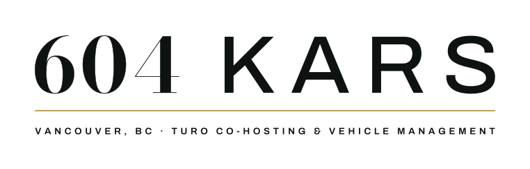

# 604 Kars

  

## Turo Co-hosting & Vehicle Management in Metro Vancouver

**604 Kars** runs your car on Turo end to end — listing, pricing, guest screening, handoffs, cleaning, fuel and damage claims. You keep the title, the keys, and the larger half of every trip.

### Key Features

- **Full Service Management** — We handle everything from listing to claims
- **Guest Screening** — Vetted renters for your peace of mind
- **Flexible Terms** — No setup fee. No lock-in. Pull your car off the platform whenever
- **Transparent Split** — You keep the larger half of every trip
- **Local Expertise** — Metro Vancouver based, serving the local community

### How It Works

1. **List** — We create and manage your Turo listing
2. **Screen Guests** — Every renter is carefully vetted
3. **Handle Logistics** — We coordinate handoffs and pickups
4. **Manage Claims** — Any damage claims are handled by us
5. **Earn** — You receive your share of trip revenue

### Contact

📞 Call or text: **236-788-8944**  
🌐 Website: [604kars.com](https://604kars.com)

### Services

- Vehicle listing and optimization
- Pricing management
- Guest screening and verification
- Booking coordination
- Damage claims handling
- Cleaning coordination
- Fuel management

---

**Your car earns nothing in the driveway. Let's change that.**
